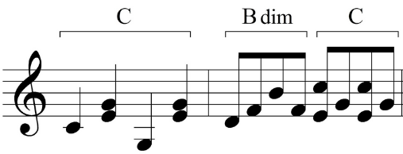

# Melody

Many types of music have a melody - a set of notes which carries the words in a song, or the theme tune for a movie which is instantly recognisable (like Star Wars). The melody can be played by different instruments, and treated in many ways, to provide interest in the piece.

## Conjunct

Conjunct describes a melody that moves in distinct steps or intervals, smoothly, and in a connected way. These steps are small, whole or half steps moving connectedly up or down the scale. In other words, movements up or down the scale in connected whole or half steps is said to be "conjunct". A good example of a conjunct song is the well known music for "Row, Row, Row Your Boat." Another good source of conjunct melodies are the many examples of plainsong. The opposite of conjunct is disjunct.

## Disjunct

A melodic line that moves by leaps and skips rather than in steps. In the song, "Row, row, row your boat," the passage "merrily, merrily, merrily, merrily" is disjunct. The opposite of disjunct is conjunct.

## Triadic

A triadic melody uses notes that belong to a triad – a three note chord, which is usually the tonic chord which helps us work out what key we are in.

## Broken chords

A chord in which the notes are not played simultaneously but rather they are played successively. They may follow singly one after the other, or two notes may be immediately followed by another two, for example. See also arpeggio in this list, which as an accompaniment pattern may be seen as a kind of broken chord.

## Scalic

Scalic melodies are melodies that follow the order of a particular scale.  Similar to conjunct melodies except that a scalic melody can only move up or down to the next note of the scale, whereas a conjunct melody can have a few little jumps.

## Arpeggio

Playing the notes of a chord consecutively (harp style). A broken chord in which the individual notes are sounded one after the other instead of simultaneously, usually ascending. In music for piano, this is sometimes a solution in playing a wide-ranging chord whose notes cannot be played otherwise.

## Intervals within the octave

An interval is the distance between two notes. Intervals are the building blocks to everything melodic a musician creates in music because all music can be broken down to a base level of note intervals.

## Passing notes

A passing note is a non-harmonic note that appears between two notes in stepwise motion in part writing. Usually a passing note is a link between a melodic interval of a third in one of the voices.

A passing note played on its own might sound strange, even horrible, with the harmony which is around it. But because the passing note happens normally quickly, it sounds OK.

The passing note highlighted in red here is not part of the C major chord underneath it. But because it moves between a C and an E, both of which are in the C major chord, it sounds OK.

## Diatonic

On the modern keyboard, the white keys are considered the diatonic notes, and scales (a series of notes in order from low to high or high to low) that can be made using only those whole-steps and half-steps are considered diatonic scales.

The major and natural minor scales are all diatonic.

This C major scale is diatonic, with tones marked as "W") (whole step) and semitones marked as "H" (half step).

## Chromatic

Any music or chord that contains notes not belonging to the diatonic scale. Music which proceeds in half steps. On a modern keyboard playing all the white and black notes going up or down is playing a chromatic scale.

Slide/portamento

Ornamentation (acciaccatura, appoggiatura etc)

Ostinato

Phrasing, articulation

Riff

Pitch bend

Melisma

Hook

Motif

Glissando/slide

Improvisation

Blue notes